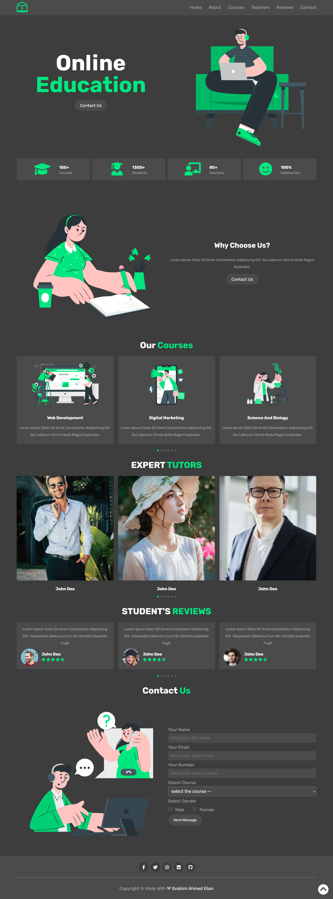

# Online Education - landing page

## Table of contents

- [Overview](#overview)
  - [User ability](#user-ability)
  - [Screenshot](#screenshot)
  - [Links](#links)
- [My process](#my-process)
  - [Built with](#built-with)
  - [What I learned](#what-i-learned)
- [Author](#author)

## Overview

### User ability

Users should be able to:

- View the optimal layout for the site depending on their device's screen size
- See hover states for all interactive elements on the page
- Switch between the slides by dragging the slides right and left

### Screenshot



### Links

- Live Site URL: [click here](https://ibrahim11elian.github.io/online-education-landing-page/)

## My process

### Built with

- Semantic HTML5 markup
- CSS custom properties
- Flexbox
- CSS Grid
- Large-screen-first workflow
- javscript
- swiper js (for sliding)

### What I learned ?

I learned some awesome stuff like dealing with beautiful library like swiper to build the slider.

```html
<!-- Slider main container -->
<div class="swiper .container">
  <!-- swiper wrapper -->
  <div class="swiper-wrapper">
    <!-- Slides -->
    <div class="swiper-slide slide">
      <div class="image">
        
      </div>
      <div class="content">
        <h3>web development</h3>
        <p>
          Lorem ipsum dolor sit amet consectetur adipisicing elit. Qui laborum
          omnis nulla magni! Explicabo.
        </p>
      </div>
    </div>

    <div class="swiper-slide slide">
      <div class="image">
        
      </div>
      <div class="content">
        <h3>digital marketing</h3>
        <p>
          Lorem ipsum dolor sit amet consectetur adipisicing elit. Qui laborum
          omnis nulla magni! Explicabo.
        </p>
      </div>
    </div>
  </div>
  <!-- pagination -->
  <div class="swiper-pagination"></div>
</div>
```

```js
// swiper js controle.

var swiper = new Swiper(".swiper", {
  spaceBetween: 20,
  grabCursor: true,
  loop: true,
  pagination: {
    el: ".swiper-pagination",
    clickable: true,
  },
  breakpoints: {
    540: {
      slidesPerView: 1,
    },
    768: {
      slidesPerView: 2,
    },
    1024: {
      slidesPerView: 3,
    },
  },
});
```

## Author

- Frontend Mentor - [@ibrahim11elian](https://www.frontendmentor.io/profile/ibrahim11elian)
- Facebook : [@ibrahim11ahmed](https://www.facebook.com/ibrahim11ahmed/)
- Linkedin : [@ibrahim-ahmed-a8bba9196](https://www.linkedin.com/in/ibrahim-ahmed-a8bba9196/)
